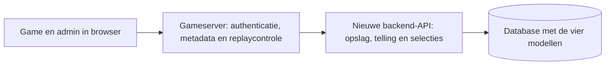

# Cascade Command: opgeslagen gegevens en backend-API

**Overdracht aan backendontwikkelaar · 6 oktober 2026**

Dit document beschrijft de huidige implementatie van Cascade Command. Het is gebaseerd op het databaseschema, de servercode en de admininterface. Het bevat velddefinities en fictieve voorbeelden, geen export van echte spelers of IP-adressen. De voorgestelde vervanging van de opslag staat apart aangegeven.

## 1. Overzicht

De online game bewaart vier soorten records in één database. De admin heeft de tabs **Leaderboard** en **Statistieken**. Spelsessies ondersteunen de game, maar worden niet als aparte lijst in de admin getoond.

| Onderdeel | Tabel | Wat wordt bewaard? | Bewaarbeleid |
|---|---|---|---|
| Highscores | `scores` | Zelfgekozen spelernaam, punten, aantal operationele diensten, speeldatum, spelversie en technische IDs | Geen automatische termijn online. Verwijderen of resetten via beheer. |
| Tijdelijke spelsessies | `sessions` | Ronde-ID, scenarioseed, spelversie, start, verloopmoment en of de score al is ingediend | Geldig gedurende 30 minuten. Verlopen sessies worden bij een volgende sessiestart verwijderd. |
| Bezoeken en gespeelde rondes | `analytics_events` | Bezoek/start, eventuele afronding en scoreopslag, resultaat, speeltijd en bezoekmetadata | IP na 30 dagen op `null`; het hele detailrecord na 90 dagen verwijderen. |
| Dagtotalen | `analytics_daily` | Aantallen bezoeken, starts, afgeronde rondes en scoreopslagen; som van speeltijd en punten | Blijven bewaard wanneer de detailrecords verdwijnen. |

**Belangrijk:** een bezoek, een gespeelde ronde en een opgeslagen highscore zijn verschillende gebeurtenissen. Iemand kan spelen en afronden zonder een naam of highscore op te slaan. Er is geen vaste speler-ID en geen koppeling van elke ronde aan een specifiek bezoekrecord.

Online opslag: Sites/Cloudflare D1, binding `DB`. Lokaal staan scores in `data/leaderboard.json` en statistieken in `data/analytics.json`; lokale sessies staan alleen in het servergeheugen. Lokale en online gegevens zijn afzonderlijk.

## 2. Datadictionary

De namen hieronder zijn de huidige databasekolommen. `null` betekent ontbrekend/nog niet bekend. Bij tekstmetadata wordt ook `""` gebruikt voor onbekend. De flags `saved` en `consumed` zijn nu integers `0`/`1`.

### 2.1 Highscores: `scores`

| Veld | Type / leeg? | Betekenis en herkomst |
|---|---|---|
| `id` | Tekst, verplicht, primaire sleutel | UUID van de score, door de server gemaakt. |
| `session_id` | Tekst, verplicht, uniek | ID van de ronde waarmee de score is ingediend. Maximaal één score per sessie. Niet meegestuurd in de openbare leaderboard- of adminlijst/export. |
| `name` | Tekst, verplicht | Zelfgekozen naam na de ronde. NFKC-normalisatie, trimmen, opeenvolgende spaties samenvoegen. 1–18 letters/cijfers/spaties of `.`, `_`, `-`. Geen accountnaam. |
| `score` | Integer, verplicht | Serverberekend spelresultaat. Beheer kan dit aanpassen naar 0–9.999.999. |
| `services` | Integer, verplicht | Aantal nog operationele diensten na afloop: 0–3. De afzonderlijke dienstgezondheid wordt niet opgeslagen. |
| `date` | Tekst, verplicht | UTC ISO 8601-tijdstip van scoreopslag. Blijft gelijk bij bewerken in beheer. |
| `version` | Tekst, verplicht | Klassement-/spelregel-ID, bijvoorbeeld `cascade-3-14f91b15`. |

Sortering: `score DESC`, daarna `services DESC`, `date ASC` en `id ASC`. De game toont de eerste 10. Online worden alle ingediende scores bewaard, ook van eerdere spelregelversies. Lokaal houdt de spelserver maximaal 100 scores per spelregelversie over.

Een handmatige aanpassing overschrijft `name`, `score` en `services`. Er is momenteel geen wijzigingshistorie of auditlog. De oorspronkelijke speelresultaten in de statistieken worden hierbij niet aangepast.

### 2.2 Tijdelijke spelsessies: `sessions`

| Veld | Type / leeg? | Betekenis en herkomst |
|---|---|---|
| `id` | Tekst, verplicht, primaire sleutel | Servergemaakte UUID; de browser gebruikt dit om de ronde af te ronden of een score in te dienen. |
| `seed` | Integer, verplicht | Scenarioseed voor de deterministische scorecontrole. |
| `version` | Tekst, verplicht | Spelregelversie waarmee de ronde is gestart. |
| `started` | Integer, verplicht | Starttijd op de server in Unix-milliseconden. |
| `expires` | Integer, verplicht | `started + 30 minuten`, in Unix-milliseconden. |
| `consumed` | Integer, verplicht, standaard 0 | 1 zodra een score succesvol is opgeslagen. Voorkomt opnieuw indienen, ook nadat de beheerder die score verwijdert. |

Maximaal 500 niet-verbruikte sessies tegelijk. Sessies en scores hebben een logische relatie, maar de huidige SQL heeft **geen foreign key**. Dat is relevant voor een nieuwe database: het verwijderen van een verlopen sessie mag nooit automatisch de blijvende score verwijderen.

### 2.3 Bezoek- en rondedetails: `analytics_events`

| Veld | Type / leeg? | Betekenis en herkomst |
|---|---|---|
| `id` | Tekst, verplicht, primaire sleutel | `visit:<bezoek-UUID>` of `round:<sessie-UUID>`. Deduplicatiesleutel. |
| `kind` | Tekst, verplicht | `visit` of `round`. Afronding en scoreopslag wijzigen het bestaande `round`-record; ze maken geen extra eventrecord. |
| `started` | Integer, verplicht | Serverontvangsttijd van het bezoek of starttijd van de ronde, in Unix-milliseconden. |
| `day` | Tekst, verplicht | Startdatum `YYYY-MM-DD` volgens `Europe/Amsterdam`. |
| `version` | Tekst, verplicht | Spelregelversie bij het bezoek of de rondestart. |
| `finished` | Integer of null | Servertijd waarop de geverifieerde afronding is geregistreerd, in Unix-milliseconden. Null bij een bezoek of nog niet geregistreerd ronde-einde. |
| `saved` | Integer, standaard 0 | 1 als de ronde ook een highscore opleverde. Geen bewijs dat de score nog bestaat: beheer kan die later verwijderen. |
| `score` | Integer of null | Oorspronkelijk serverberekend ronde-resultaat. Null voordat een ronde is afgerond en bij bezoekrecords. |
| `services` | Integer of null | 0–3 operationele diensten bij een afgeronde ronde. |
| `duration` | Getal of null | Simulatiespeeltijd in seconden: `game.tick / 60`. Pauzetijd telt niet mee; dit is niet `finished - started`. |
| `ip` | Tekst of null | Genormaliseerd IPv4-/IPv6-adres, voor zover betrouwbaar beschikbaar. Na 30 dagen null. |
| `ip_source` | Tekst, verplicht | `cloudflare`, `socket` of `unavailable`. |
| `country` | Tekst, verplicht | Landcode van twee hoofdletters, bijvoorbeeld `NL`, of `""` voor onbekend. Online uit netwerkmetadata; lokaal wordt geen land bepaald. |
| `browser` | Tekst, verplicht | Afgeleid uit User-Agent: `Edge`, `Opera`, `Firefox`, `Chrome`, `Safari` of `Onbekend`. |
| `os` | Tekst, verplicht | `Android`, `iOS / iPadOS`, `Windows`, `macOS`, `Linux` of `Onbekend`. |
| `device` | Tekst, verplicht | `Bot / automatisch`, `Tablet`, `Telefoon`, `Computer` of `Onbekend`. Schatting op basis van User-Agent. |
| `language` | Tekst, verplicht | Eerste taal uit `Accept-Language`, maximaal 35 tekens, bijvoorbeeld `nl-NL`, anders `""`. |
| `referrer` | Tekst, verplicht | Alleen de externe hostnaam van de verwijzende website, maximaal 253 tekens. Zelfde website, direct bezoek of ongeldige waarde wordt `""`. Geen pad of querystring. |
| `viewport` | Tekst, verplicht | Schermbreedteklasse: `<768 px`, `768–1199 px`, `≥1200 px` of `""`. De exacte breedte wordt niet bewaard. |

De metadata komt alleen bij het bezoek of de rondestart binnen. Afronding vult de resultaatvelden aan en gebruikt geen nieuwe bezoekmetadata. De bezoek-UUID is alleen een tijdelijk ID voor die paginalading; herladen geeft een nieuw bezoek. De rondes zijn via `round:<id>` technisch aan een sessie te relateren. De statistieken-API retourneert dit ID niet.

De huidige online server gebruikt alleen `CF-Connecting-IP`; lokaal gebruikt hij het socketadres. Een IP uit de JSON-body of een willekeurige `X-Forwarded-For` wordt niet overgenomen. Het bekende gedeelde Cloudflare-Workeradres en ongeldige/ongedefinieerde adressen worden als onbekend behandeld. Country wordt online alleen vastgelegd wanneer het IP bruikbaar is.

### 2.4 Dagtotalen: `analytics_daily`

| Veld | Type / leeg? | Betekenis |
|---|---|---|
| `day` | Tekst, verplicht, primaire sleutel | `YYYY-MM-DD`, tijdzone `Europe/Amsterdam`. |
| `visits` | Integer, standaard 0 | Aantal geregistreerde bezoeken. |
| `starts` | Integer, standaard 0 | Aantal succesvol gestarte rondes; geen demo’s. |
| `completed` | Integer, standaard 0 | Aantal eenmaal geverifieerd afgeronde rondes, ook zonder leaderboardinzending. |
| `saved` | Integer, standaard 0 | Aantal rondes met eenmaal opgeslagen highscore. |
| `duration_sum` | Getal, standaard 0 | Som van simulatiesecondes van de afgeronde rondes. |
| `score_sum` | Integer, standaard 0 | Som van oorspronkelijke scores van de afgeronde rondes, ook als ze niet in het leaderboard zijn opgeslagen. |

Alle rondetotalen worden toegerekend aan de **startdag** van de ronde. Een afronding of scoreopslag na middernacht hoort dus bij die eerdere startdag. Dagtotalen omvatten alle spelversies; ze zijn momenteel niet per spelversie opgesplitst.

## 3. Wat de admin berekent of toont

Onderstaande overzichten zijn afgeleid. Ze zijn geen extra tabellen om naast de vier bovenstaande modellen op te slaan.

| Overzicht / waarde | Berekening / selectie |
|---|---|
| Totaal bezoeken, starts, afgerond, opgeslagen | Som van de vier dagtellers binnen de gekozen periode. |
| Afrondingspercentage | `100 × completed / starts`, mits `starts > 0`. |
| Gemiddelde speeltijd | `duration_sum / completed`, mits `completed > 0`. |
| Gemiddelde score | `score_sum / completed`, mits `completed > 0`; dus niet alleen highscores. |
| Daggrafiek en dagcijfers | Maximaal laatste 30 kalenderdagen binnen de gekozen periode; lege dagen als nul. |
| Apparaat/browser/land/herkomst | Groepering van **bezoekrecords**, maximaal 8 categorieën per soort, binnen de gekozen periode en beschikbare details van maximaal 90 dagen. |
| Besturingssysteem | Wordt ook gegroepeerd in de API en staat bij recente rondes; heeft nu geen eigen categoriekaart in de admin. |
| Unieke IP-adressen | Aantal verschillende bekende IP’s bij bezoeken, binnen de periode en maximaal laatste 30 dagen. Geen aantal unieke personen. |
| IP-dekking | `network.known` bezoeken met IP versus `network.samples` bezoeken in hetzelfde maximaal 30-dagenvenster. |
| IP-overzicht | Maximaal 20 adressen, met land, bezoekaantal, rondestarts en laatst gezien. Sorteert op starts, bezoeken, dan laatst gezien, aflopend. |
| Recente rondes | Start/einde, oorspronkelijk resultaat, opgeslagen ja/nee, duur, versie en metadata. 25 per pagina; maximaal 90 dagen details. |
| Klassementen | Spelregel-ID met aantal bestaande scores; afgeleid uit `scores.version`. |
| Leaderboard en export | Geselecteerde spelversie, naamfilter en rangschikking. Admin: 50 per pagina. Export: alle scores van die versie, zonder `session_id`. |

Periodes: vandaag (`days=1`), 7, 30 of 90 dagen, of sinds de start (`days=0`). Vandaag en de huidige dag tellen mee. De statistieken-API retourneert ook `firstDay`, `generatedAt`, `timezone`, paginering en bewaartermijnen als antwoordmetadata; die zijn geen aanvullende opgeslagen spelersvelden.

## 4. Registratieverloop

1. **Spelpagina geladen:** browser maakt een bezoek-UUID en stuurt `POST /api/visit`. Eén `visit`-record en één verhoging van `visits`. Herladen telt opnieuw. Alleen beheer openen maakt geen gamebezoek.
2. **Start missie geslaagd:** server maakt een sessie en een `round`-record met dezelfde ronde-ID. Eén verhoging van `starts`. Demo/startscherm-animatie maakt geen spelsessie of analytics-ronde.
3. **Ronde afgelopen:** browser stuurt het sessie-ID en de geaccepteerde acties naar `POST /api/finish`. Server speelt de acties opnieuw na, controleert de minimale verstreken tijd en vult `finished`, `score`, `services`, `duration` aan. Dagtotalen voor afronding verhogen eenmaal.
4. **Speler kiest Bewaar:** `POST /api/score` stuurt ook de naam. De server controleert het resultaat, bewaart één score, verbruikt de sessie en zet `saved=1`. Scoreopslag kan de afronding ook registreren als het aparte finishverzoek ontbreekt.
5. **Beheer wijzigt de highscorelijst:** dit verandert de historische gebruiksstatistieken niet. Reset verwijdert scores en sessies van alleen de gekozen spelversie, niet de analytics.

Dubbele bezoek-, finish- of scoreverzoeken mogen de telling niet verhogen. Online levert een score-retry dezelfde score-ID op. De huidige implementatie laat analyticsfouten bij start/scoreopslag de game niet blokkeren; daarom kunnen meetgegevens ontbreken. Een niet-afgeronde ronde kan nog lopen, verlaten zijn of een verloren eindbericht hebben. Bestaande gegevens bevatten geen aparte reden voor afhaken.

## 5. Huidig browser-API-contract

Deze routes bestaan al. Ze vormen de referentie als de nieuwe backend de huidige API rechtstreeks overneemt. Alle bodies zijn JSON en alle tijdstippen/resultaten worden server-side bepaald.

### 5.1 Game en registratie

| Methode en route | Body / invoer | Belangrijkste antwoord |
|---|---|---|
| `GET /api/meta` | Geen body | Actuele `version`, online `hosting: "sites"`, `mobileUrls`. Dit is configuratie, geen spelersrecord. |
| `POST /api/visit` | `{ id, analytics: { referrer, width } }` | `201 { recorded: true }`; bezoek-ID moet UUID v4 zijn. |
| `POST /api/session` | `{ analytics: { referrer, width } }` of `{}` | `201 { id, seed, version }`, of `429` bij teveel actieve sessies. |
| `POST /api/finish` | `{ session, actions }` | `200 { recorded: true }` na servercontrole; geen openbare highscore. |
| `POST /api/score` | `{ session, name, actions }` | Eerste inzending `201`; retry `200`. Antwoord `{ rank, score, id, scores }`, met actuele openbare top 10. |
| `GET /api/leaderboard` | Geen body | `{ scores: [{ id, name, score, services, date }] }` voor de actuele spelversie. |

`analytics.referrer` is de browserverwijzer; de server bewaart alleen de gesaneerde externe hostnaam. `analytics.width` is de browserbreedte als integer 200–10.000; de server bewaart uitsluitend de klasse. IP, land, apparaat, browser, OS en taal zijn geen vertrouwde velden uit de requestbody.

`actions` is een lijst van maximaal 1.000 geaccepteerde spelacties met `tick`, `type` (`shot`/`scan`) en zo nodig `x`/`y`. Er zijn 60 ticks per simulatieseconde. Schoten gebruiken coördinaten 0–1.000. De gedeelde engine controleert volgorde, grenzen, energie, cooldown en acties na het einde. Acties worden voor controle ontvangen, maar niet blijvend opgeslagen.

Voorbeeld van bezoekregistratie, uitsluitend fictieve gegevens:

```json
{
  "id": "12345678-1234-4123-8123-123456789abc",
  "analytics": { "referrer": "", "width": 1440 }
}
```

**Scorecontrole behouden:** de browser mag niet simpelweg een eigen `score`, `services` of `duration` insturen die als waarheid wordt opgeslagen. De huidige server berekent ze met de gedeelde replay-engine en de opgeslagen sessie/seed. Hij weigert sessies met een verkeerde spelversie, verlopen sessies en afrondingen die eerder zijn ontvangen dan `simulatieduur − 1,5 seconde` sinds de start. Een sessie moet nog geldig zijn bij een score-retry.

De huidige game-POSTs staan cross-site verkeer niet toe. Bezoekregistratie vereist dezelfde Origin. Gamebodies hebben een limiet van 160.000 bytes. Een opslagmigratie mag deze controles niet onbedoeld omzeilen.

### 5.2 Beheer

Alle onderstaande routes zijn alleen voor een geautoriseerde beheerder.

| Methode en route | Invoer | Antwoord / werking |
|---|---|---|
| `GET /api/admin/me` | Geen body | `{ email, hosting }` van de geverifieerde beheerder. Geen databasegebruikersrecord. |
| `GET /api/admin/leaderboard` | Query `version`, `page`, `q` | `{ scores, total, versions, currentVersion, version, page, pageSize: 50 }`. |
| `GET /api/admin/export` | Query `version` | `{ exportedAt, version, scores }`, zonder `session_id`. Huidige export is alleen voor highscores. |
| `POST /api/admin/update` | `{ id, version, expected: { name, score, services }, name, score, services }` | `{ saved: true }`; alleen bij overeenkomst met de oude veldwaarden. Datum/version blijven gelijk. |
| `POST /api/admin/delete` | `{ id, version, expected: { name, score, services } }` | `{ saved: true }`; idem controle op achterhaalde invoer. |
| `POST /api/admin/reset` | `{ version, confirmation: "RESET" }` | `{ removed }`; verwijdert scores én sessies van alleen die versie. |
| `GET /api/admin/stats` | Query `days` = 0/1/7/30/90, `page` vanaf 1 | Zie structuur hieronder. |

Adminresultaten gebruiken paginering. Een ongeldige selectie geeft `400`; achterhaalde update/delete geeft `409`. Geen authenticatie: `401`; geen toegang: `403`; opslag tijdelijk onbereikbaar: `503`. Admin-POSTs vereisen dezelfde Origin, met maximaal 8.192 bytes JSON. Gegevensantwoorden hebben `Cache-Control: no-store`.

Structuur van het statistiekenantwoord:

```text
totals: { day, visits, starts, completed, saved, duration_sum, score_sum }
daily: [{ day, visits, starts, completed, saved, duration_sum, score_sum }]
groups: {
  device: [{ label, count }], browser: [{ label, count }],
  os: [{ label, count }], country: [{ label, count }],
  referrer: [{ label, count }]
}
network: { uniqueIps, known, samples }
ips: [{ ip, country, visits, starts, lastSeen }]
recent: [{
  started, finished, saved, version, score, services, duration,
  ip, ip_source, country, browser, os, device, language, referrer, viewport
}]
recentTotal, page, days, pageSize: 25
firstDay: "YYYY-MM-DD" of null
generatedAt: Unix-milliseconden
timezone: "Europe/Amsterdam"
ipDays: 30
detailDays: 90
```

`totals.day` is momenteel een lege string; het is een technische bijwerking van de somstructuur. `recent` geeft geen event-/sessie-ID terug. De admin mag niet via deze response een nieuwe ronde kunnen indienen.

## 6. Regels die de nieuwe opslag moet overnemen

| Regel | Waarom / huidige werking |
|---|---|
| Unieke score per `session_id` | Score-retries leveren één record op; scoreopslag en `consumed=1` gebeuren atomair. |
| Uniek analytics-event-ID | Een opnieuw bezorgd bezoek/start mag geen dubbele event- of dagtelling maken. |
| Afronding alleen bij `finished IS NULL` | `completed`, `duration_sum` en `score_sum` worden precies eenmaal bijgewerkt. |
| Opslagtelling alleen bij `saved=0` | `saved` wordt precies eenmaal opgehoogd, ook bij een retry na een deels geslaagde operatie. |
| Permanente score blijft na sessie-expiry | Geen cascade-delete van scores bij sessieopruiming. |
| Score verwijderen laat sessie verbruikt | Een verwijderde score kan niet opnieuw worden ingediend met dezelfde nog geldige sessie. |
| Reset begrensd op spelversie | Andere klassementen en alle gebruikshistorie blijven behouden. |
| Conflictcontrole bij adminwijziging | Vergelijk naam, score en diensten met `expected`; overschrijf geen intussen gewijzigde record. |
| Amsterdamse startdag | Tellers, periodes en afronding blijven consistent bij middernacht/zomer- en wintertijd. |
| Scheiding authentieke en clientmetadata | Beheerdersidentiteit en IP-herkomst mogen niet uit vrije clientvelden worden overgenomen. |

Benodigde huidige indexen: `sessions(expires)`; unieke `scores(session_id)`; ranking op `scores(version, score DESC, services DESC, date, id)`; `analytics_events(started)`; `analytics_events(day, kind)`; primaire sleutel op `analytics_daily(day)`.

De huidige online beheeridentiteit komt van door Sites geverifieerde headers plus een server-side allowlist. Lokaal is beheer beperkt tot localhost vanaf deze Mac. Er is geen aparte users-/rollen-/beheerlogtabel in deze game. De nieuwe API moet zijn eigen vertrouwde authenticatiepad gebruiken; een door de browser opgegeven e-mailadres is geen beheerautorisatie.

## 7. Bewaartermijnen en opruiming

- IP-retentie is gebaseerd op de starttijd van het event: ouder dan `30 × 86.400.000 ms` → `ip = null`. Andere metadata blijft tot de detailtermijn bewaard.
- Ouder dan `90 × 86.400.000 ms` → het hele analytics-detailrecord verwijderen. Dagtotalen blijven staan.
- Huidige opruiming draait bij een nieuw bezoek/start of een admin-statistiekverzoek. Er is geen afzonderlijke geplande nachtelijke taak. Zonder verkeer kunnen verlopen waarden dus nog in de opslag aanwezig zijn totdat opruiming wordt uitgevoerd.
- De IP-statistieken selecteren bovendien expliciet maximaal 30 dagen. Andere uitsplitsingen gebruiken de overgebleven details van maximaal 90 dagen.
- Sessies verlopen na 30 minuten; hun fysieke opruiming gebeurt bij een volgende sessiestart.
- Highscores hebben online geen automatische termijn. Oudere spelregelversies blijven buiten het actuele openbare klassement bewaard.

Dit beschrijft de huidige werking. Een gegarandeerde fysieke verwijdering op de termijn vereist in de nieuwe backend aanvullende geplande opruiming; dat is een voorstel, geen bestaande feature.

## 8. Gegevens die momenteel niet blijvend worden opgeslagen

- Volledige gameplay-actielijsten, klikken, pointerbewegingen of een replaybestand.
- Live Risk Feed, individuele dreigingen, leveranciersintelligence, gescande links en de Galaxy-netwerkstatus.
- Afzonderlijke dienstgezondheid, aantal onderscheppingen, combo’s, fouten of voorkomen kettingreacties. Alleen totale score en aantal operationele diensten gaan naar opslag.
- Het gekozen thema, Easter Egg-status of getoonde kaarten als analytics-dimensie. Thema/plugin zijn configuratie; ontdekte Council-kaarten zijn apparaatgebonden browseropslag, geen admingegevens.
- Een blijvende bezoeker-/speler-ID, bezoek→ronde-ID-relatie, spelerprofiel, spelersmailadres of spelersaccount.
- Volledige User-Agent, volledige referrer-URL, exacte schermbreedte/-hoogte of precieze locatie.
- Adminwijzigingshistorie, uitvoerende beheerder of reden van scorebewerking/verwijdering.

`scores.version` is de spelregelidentiteit, **niet** het Sites-publicatieversienummer. Themawissels en de Easter Egg-schakelaar wijzigen het klassement niet. Een numerieke spelregelwijziging kan wel een nieuwe versie opleveren. De volledige oude spelconfig wordt momenteel niet als apart databaseobject bewaard.

## 9. Voorstel voor de backendoverdracht

**Voorgestelde eerste stap:** laat de bestaande gameserver de spelacties en beheerautorisatie controleren en vervang de opslagadapters door calls naar de nieuwe backend-API. De backend ontvangt dan alleen door die server gevalideerde scores, sessies en gesaneerde metadata. De bestaande browserroutes uit hoofdstuk 5 kunnen gelijk blijven.



Benodigde opslagoperaties: sessie maken/ophalen, score per sessie opzoeken/atomair bewaren, top 10 ophalen, adminlijst/export/update/delete/reset, event idempotent registreren, ronde idempotent afronden/als opgeslagen markeren, statistieken opvragen en retentie uitvoeren. Dit zijn de huidige verantwoordelijkheden van de adapters; de concrete interne routebenaming kan je collega kiezen.

Als de nieuwe API rechtstreeks browserverkeer overneemt, moeten ook de replaycontrole, metadata-normalisatie, oorsprongcontroles, authenticatie en validatie uit hoofdstuk 5/6 worden overgenomen. Als een proxy wordt gebruikt, moet de bezoekmetadata via een vertrouwd serverpad komen; het backend-socket-IP kan anders het proxyadres zijn.

Dit document bouwt de nieuwe API of koppeling nog niet en kiest geen backendframework. Er zijn geen bestaande live records gelezen, veranderd of geëxporteerd.

## 10. Bronnen in de huidige code

- [Schema](../db/schema.ts) en [eerste SQL-migratie](../drizzle/0000_amusing_sentry.sql) / [analytics-migratie](../drizzle/0001_free_firedrake.sql).
- [Publieke game-API](../worker/api.js), [score-/sessieopslag](../worker/storage.js) en [gedeelde replay-engine](../src/engine.js).
- [Analytics-normalisatie en rapportage](../analytics/common.js), [online analytics-opslag](../worker/analytics-storage.js) en [browserregistratie](../src/analytics.js).
- [Admin-API en toegang](../admin/api.js), [online beheeropslag](../worker/admin-storage.js), [admininterface](../public/admin.js) en [statistiekeninterface](../public/admin-stats.js).
- [Lokale server](../server.mjs), [lokale analytics](../analytics/local-storage.js), [lokale beheeropslag](../admin/local-storage.js) en [spelersinformatie](../public/privacy.html).

Veldnamen, grenzen en gedrag zijn gecontroleerd tegen deze code op 6 oktober 2026. Bij verdere ontwikkeling blijft de code leidend; dit is een gedateerde overdracht.
