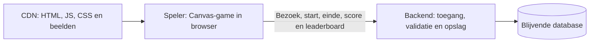

# Cascade Command: advies voor productie

**6 oktober 2026 · Advies, geen implementatiebesluit**

## Aanbevolen richting

Behoud de bestaande JavaScript-/Canvas-spelengine. Lever de gebouwde gamebestanden via een CDN en gebruik een backend-API met blijvende databaseopslag voor sessies, scorecontrole, leaderboard, analytics en beheer. Astro is een passende keuze voor een website rond de game, maar is geen vereiste voor de game zelf.

Voor de zelfstandige game zou ik eerst de bestaande frontend en de productiehosting verbeteren. Als de game onderdeel wordt van de Astro-website van RiskStudio, kan dezelfde spelmodule op een eigen gamepagina worden ingebouwd. De animatielus blijft daarbij in de browser.

De huidige spelers spelen onafhankelijke rondes. Ze delen een leaderboard en gebruiksstatistieken; ze bewegen niet samen in één gesynchroniseerde spelwereld. De aanbevolen architectuur geldt voor dat bestaande spelmodel.

## Waar de prestaties vandaan komen

| Doel | Belangrijkste factoren | Rol van Astro |
|---|---|---|
| Snel speelgereed | Downloadomvang, aantal opeenvolgende verzoeken, compressie, CDN/browsercache en beelddecode | Kan de statische pagina en scriptbuild verzorgen. Een frameworkwissel alleen garandeert geen kortere laadtijd. |
| Vloeiend spelen | Canvas-tekenwerk, gameberekeningen en werk op de browserthread; prestaties van het apparaat | De bestaande game blijft client-JavaScript uitvoeren. |
| Veel gelijktijdige gebruikers | Statische bestanden goedkoop uitdelen; backendcapaciteit, databasequeries, scorevalidatie en sessiebeheer | Staat grotendeels los van de frontendframeworkkeuze. |

De huidige frontend gebruikt `requestAnimationFrame` met een simulatiestap van 60 Hz. HUD-wijzigingen zijn begrensd op 15 keer per seconde. De beeldschaal is begrensd op een device-pixelratio van 2. Dit zijn nuttige bestaande keuzes om te behouden en op echte apparaten te controleren.

Tijdens een actieve ronde wordt het leaderboard niet periodiek opgevraagd; buiten actieve rondes gebeurt dat in zichtbare tabs om de 15 seconden. Er worden geen netwerkverzoeken per animatieframe gedaan. Een bezoek/start en het uiteindelijke resultaat leveren wel API-verkeer op. De server simuleert de ingestuurde acties opnieuw voor scorecontrole.

## Astro ten opzichte van de huidige frontend

Astro kan statische HTML opleveren en gewone JavaScript-modules verwerken en bundelen. Een extra React-/Vue-laag is hiervoor niet nodig. De huidige game heeft al een eigen Canvas-renderer en geen frameworkcomponenten die het volledige speelveld telkens opnieuw renderen. Mijn verwachting is daarom dat een overstap naar Astro vooral voordelen geeft voor websiteorganisatie en buildintegratie, niet vanzelf voor de framerate. [Astro: islands](https://docs.astro.build/en/concepts/islands/), [scripts](https://docs.astro.build/en/guides/client-side-scripts/).

Bij integratie: mount de game eenmaal, start geen tweede animatielus en ruim listeners/renderers op bij navigatie. Houd de render- en simulatielus buiten reactieve pagina-updates. CSS/DOM-selectors en thema-assetpaden moeten op de website en de nieuwe build worden afgestemd; dit is geen garantie op een wijzigingsvrije integratie. Kies Astro wanneer het de website en het onderhoud eenvoudiger maakt, niet uitsluitend als performance-ingreep.

## Wat ik aan de hosting zou veranderen

De lokale `server.mjs` is een lokale runner: sessies staan in geheugen, scores en analytics in JSON-bestanden, met synchrone bestandswrites. Bij een serverherstart verdwijnen lokale sessies. Meerdere processen zouden ieder hun eigen sessiegeheugen hebben en dezelfde bestanden kunnen proberen te wijzigen. Die opslagopzet zou ik vervangen voor productie.

De online Worker/D1-opzet ligt dichter bij de aanbevolen verdeling: sessies en scores worden blijvend en met databaseoperaties verwerkt. De huidige build embedt echter de statische bestanden als base64 in de Worker; dit is niet dezelfde implementatie als een afzonderlijke statische assetdienst. JavaScript en CSS hebben nu `no-cache`; WebP’s met bestandsvingerafdruk hebben langdurige private browsercache. De precieze CDN-caching van de Sites-laag is hiermee niet gemeten.

Voor vaste productiehosting zou ik statische assetlevering van API-uitvoering scheiden. Cloudflare Workers Static Assets is bijvoorbeeld een mogelijkheid voor die verdeling: de platformlaag verzorgt het leveren en cachen van bestanden. Dit vereist keuze en configuratie van de productiehosting; het staat niet automatisch aan in de huidige custom Worker. [Cloudflare Static Assets](https://developers.cloudflare.com/workers/static-assets/).

De nieuwe backend van de collega kan de opslag en API-onderdelen overnemen. De score moet server-side gevalideerd blijven. Als eerst alleen de opslag wordt vervangen, kan de huidige gameserver die validatie blijven doen en daarna de nieuwe opslag-API aanroepen. Zie [gegevens en bestaande API-contracten](ADMIN_DATA_EN_BACKEND_API.md).

## Concrete verbeteringen vóór productie

1. **Frontendbouw en cache.** Bundel waar dat de module-waterval verkleint. Gebruik versiegebonden namen voor gewijzigde JS/CSS/beelden, langdurige caching voor zulke onveranderlijke bestanden en een vernieuwbare HTML-/manifestlaag. Zorg dat een bestaande ronde niet halverwege een andere release importeert. Controleer daadwerkelijke transfercompressie op de gekozen host.
2. **Gerichte eerste download.** Vraag het actieve thema en benodigde spelbeelden eerst op. Behoud compacte beelden en uitgestelde portretten/Council-onderdelen. Het bestaande budget van 800.000 bytes telt alle gepubliceerde browserbestanden; dat is niet hetzelfde als de eerste download van één speler.
3. **Apparaatprestaties meten.** Controleer beide thema’s op echte iPhone-/Android-apparaten, inclusief een goedkoper toestel en de drukste golf. Meet framerate, lange frames, inputrespons en belasting van de browserthread. Verlaag indien nodig alleen decoratief tekenwerk; behoud de spelregels en scorecontrole.
4. **API en database voorbereiden.** Zorg voor gedeelde sessieopslag, idempotente score-/eventverwerking en efficiënt geïndexeerde queries. Meet serverreplaykosten en een piek waarbij veel rondes tegelijk eindigen. Verplaats terugkerende retentie-opruiming waar passend naar een aparte taak, met behoud van de bewaartermijnen en afgeschermde beheerdata.
5. **Sessielimiet corrigeren voor het gebruikspatroon.** De huidige grens is 500 niet-verbruikte sessies. Een afgeronde ronde zonder highscore wordt niet verbruikt en kan tot de 30-minuten-expiry blijven meetellen. Dit is geen bewijs van capaciteit voor 500 gelijktijdige spelers. Behandel actief spelen, afgerond maar nog indienbaar en verbruikt als verschillende situaties, zonder het latere opslaan van een score kapot te maken.
6. **Belastbaarheid en beheer aantonen.** Test de verwachte bezoekerspiek en een afgesproken marge, inclusief starts, afrondingen, retries en scoreopslagen. Meet foutpercentages, p95-responstijden, CPU en databasewachttijden. Zorg ook voor operationele monitoring, herstelbare databaseback-ups en een gecontroleerde release/rollback.

Een D1-database verwerkt queries opeenvolgend; de haalbare doorvoer hangt af van queryduur en belasting. Read-replica’s veranderen niet vanzelf de capaciteit voor het schrijven van dagtellers. De bestaande Worker/D1-aanpak moet daarom met de daadwerkelijke werkbelasting worden gemeten. Een algemene belofte over een gebruikersaantal zou nu ongefundeerd zijn. [D1 concurrency en throughput](https://developers.cloudflare.com/d1/platform/limits/#concurrency-and-throughput).

## Voorstel voor acceptatiecriteria

Leg vooraf vast wat “snel” en “vloeiend” betekenen. Een bruikbaar begin is:

- Speelgereed op representatieve mobiele verbindingen meten vanaf navigatie tot benodigde beelden zijn gedecodeerd en Start missie actief is. Test met lege en warme cache. De exacte norm wordt afgesproken; de bestaande eerdere test gebruikte maximaal 5 seconden in een vertraagd profiel.
- Streef op de gekozen mobiele testtoestellen naar stabiel circa 60 fps bij een 60-Hz-scherm. Kijk daarnaast naar lange frames en inputvertraging; een gemiddelde alleen kan haperingen verbergen.
- Laat de API binnen afgesproken p95-latenties reageren bij de beoogde piek en behoud alle validatie-, retry- en tellingregels. Bepaal de meetbare gebruikersbelasting eerst; die is nog niet bevestigd.
- Toon aan dat een herstart/release geen opgeslagen scores verliest, herhaalde verzoeken niet dubbel tellen en back-ups daadwerkelijk kunnen worden teruggezet.

Dit zijn voorgestelde criteria. In deze adviesronde is geen nieuw apparaatprofiel of productiebelastingstest uitgevoerd. Eerdere functionele tests en browsermetingen bewijzen geen nieuwe gelijktijdige gebruikerscapaciteit.

## Geraadpleegde bronnen

Lokale code: [browsermain](../src/main.js), [engine](../src/engine.js), [renderer](../src/themes/classic/renderer.js), [lokale runner](../server.mjs), [Worker](../worker/index.js), [API](../worker/api.js), [sessie-/scoreopslag](../worker/storage.js), [analytics-opslag](../worker/analytics-storage.js), [build](../scripts/build.mjs) en [downloadbudget](../download-budget.json).

Eerdere projectmetingen: [performanceverbetering 1](performance-verbetering-1-2026-10-01.md), [performanceverbetering 2](performance-verbetering-2-2026-10-01.md). Dit zijn historische metingen met hun eigen scenario, geen actuele productiebenchmark.

De officiële Astro- en Cloudflare-documentatie is geraadpleegd op 6 oktober 2026. Externe mogelijkheden, codebevindingen en eigen advies zijn hierboven onderscheiden. Er is geen frameworkmigratie, backendwijziging of publicatie uitgevoerd.

## API-calls vanuit de Canvas-game

**Aanvulling, 6 oktober 2026.** De bestaande game doet al HTTP-verzoeken met JavaScript `fetch`, onder andere voor sessies, scores en het leaderboard. Canvas is de tekenlaag; een frontendframework is hiervoor niet vereist. Netwerkwachten kan asynchroon verlopen; responseverwerking blijft browserwerk. Plaats geen API-verzoek in ieder animatieframe. [MDN Fetch](https://developer.mozilla.org/en-US/docs/Web/API/Fetch_API/Using_Fetch).

Veiligheid moet door de backend worden afgedwongen: productie-HTTPS, autorisatie per beschermde route, server-side invoer-/spelresultaatcontrole, begrensde verzoeken en bescherming tegen herhaalde opslag. Alles wat in de browser draait kan worden bekeken en aangepast. Gedeelde geheime servicekeys horen op de server; gewone tijdelijke speler-/gebruikerssessies zijn een ander soort credential. Een proxy verplaatst die servicekey naar de server, maar moet zelf dezelfde toegangs- en invoercontroles uitvoeren. [OWASP REST Security](https://cheatsheetseries.owasp.org/cheatsheets/REST_Security_Cheat_Sheet.html).

De huidige code biedt replaycontrole, sessie-expiry, invoer-/bodygrenzen, adminautorisatie via de vertrouwde Sites-identiteit, oorsprongcontroles en idempotente scoreopslag. De publieke game vereist geen spelerslogin; adminhandelingen wel beheerautorisatie. In de onderzochte applicatiecode is geen algemene request-rate-limit per IP/gebruiker geïmplementeerd. Dit is een codebevinding, geen uitspraak over eventuele platformfilters en geen volledige beveiligingsaudit.

De huidige CSP laat netwerkverbindingen toe naar dezelfde origin (`connect-src 'self'`). Een directe nieuwe API op een ander domein vraagt aanvullende CSP-/CORS-afstemming en passende backendautorisatie; CORS is geen vervanging voor toegangscontrole. Voor de opslag-API van de collega adviseer ik voorlopig dezelfde-origin `/api` als toegangspunt te behouden en die gameserver de private backend te laten aanroepen. Spelers zien dan geen geheime servicekey. Dit is een voorstel; er is niets aan de game of infrastructuur gewijzigd.
